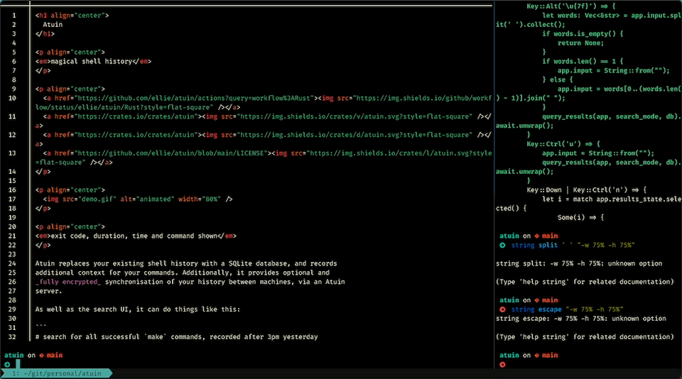

# CtrlG - A Command Line Context Switcher

CtrlG is a tool to quickly switch contexts to another directory, using a fuzzy finder.
If enabled, `ctrlg` can `cd` all split panes in the current window of a `tmux` session
to the selected directory.



## Install

Make sure you have `cargo` installed. If not, install it from [rustup.rs](https://rustup.rs).
Then install the `ctrlg` CLI by running:

```
cargo install ctrlg
```

Once the CLI is installed, you will need to set up the key binding depending on your shell.
Alternatively, you can disable the default keybind by setting `$CTRLG_NOBIND` to `true`
before running the init script, then set up your own keybind to call `_ctrlg_search_and_go`.

### Zsh

```
echo 'eval "$(ctrlg init zsh)"' >> ~/.zshrc
``````

### Bash

```
echo 'eval "$(ctrlg init bash)"' >> ~/.bashrc
```

### Fish

```
echo 'ctrlg init fish | source' >> ~/.config/fish/config.fish`
```

## Tmux Integration

To make `ctrlg` send the `cd` command to all split panes in the current `tmux`
window, set the environment variable `CTRLG_TMUX` to `true`.

### Bash/Zsh

```
export CTRLG_TMUX=true`
```

### Fish

```
set -U CTRLG_TMUX true`
```

## Configuration

`ctrlg` will look for a configuration file at `~/.config/ctrlg/config.yml`. The default
configuration is shown below:

```yaml
# configure what directories to list in the fuzzy finder
# can be any list of globbing patterns, will only show directories
# not files
search_dirs:
  - "~/.git/*"
# configure what files to check for to show in the preview window
# of the fuzzy finder. Previews will use `bat` if it is installed,
# otherwise it will use `cat`. If no matching file is found,
# the contents of the directory are listed as the preview
preview_files:
  - "README.*"
# enable or disable the preview window
previews: true
```
